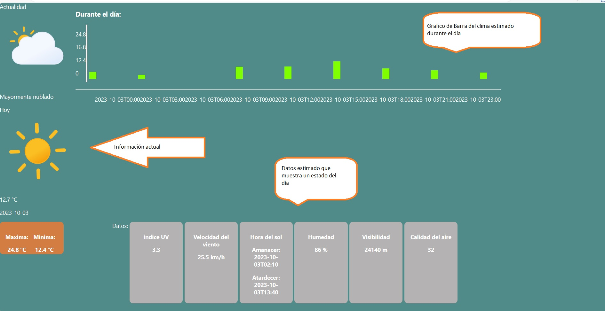

# Exposición de la pagina de clima con  datos Api de clima
En esta pagina se logro por medio de un Api de clima convertir en Json tomar los valores más representativo y modelar el clima en la fecha actual.

## Complicaciones:
* En el grafico falta que los datos se represente más modularizado.
* Presentación falta mejoras.

## Construido con 🛠️
_las herramientas que se utilizaron para crear el proyecto_

* [Flexbox](https://css-tricks.com/snippets/css/a-guide-to-flexbox/) - guia de como usar en css flexbox
* [Html](https://www.w3schools.com/html/default.asp) - Tutorial de uso html
* [JavaScript](https://www.w3schools.com/js/default.asp) - Tutorial de JavaScript
* [React](https://es.react.dev/learn) - pagina de guia 
* Conseptos de Api

## Autor ✒️

* **Nicolás Herrera** - *Trabajo Inicial* - [NicolasHerrera](https://github.com/Nicolas114188/practico-api.git)
