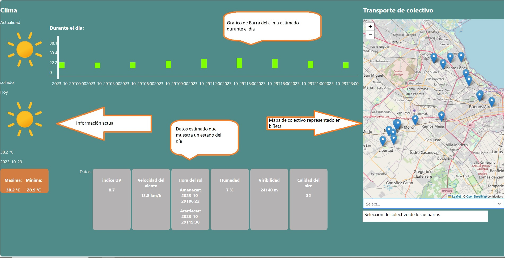

# Pagina de clima con  datos Api de clima y Transporte de colectivo
En esta página se logró por medio de un Api de clima convertir en Json, con esto valores en objeto modelar el clima en la fecha actual.
Ademas se agrego Colectivos representativo de la ciudad de Bs As usando Api desde la misma.

## items a mejorar:
* Presentación falta mejoras más estilos.
* Grafico del clima
* Se instalo una libreria Select para puede elejir la linea de colectivo el usuario se obtuvo complicaciones falta mejorar.
* mostrar los colectivo por linea y empresa.
* Mejorar y aprender más sobre componente de la libreria de mapa Leaflet. 

## Mejoras:
* Se realizo mejoras en el grafico de barra de la pagina con datos de la Api
* En la imagen toma datos del estado del tiempo actual.
* se agrego un Select que selecciona el clima a ciudades (desmostrativas) de la Argentina 

## Construido con 🛠️
_las herramientas que se utilizaron para crear el proyecto_

* [css](https://www.w3schools.com/react/react_css_styling.asp) -guia de css
* [Flexbox](https://css-tricks.com/snippets/css/a-guide-to-flexbox/) - guia de como usar en css flexbox
* [Html](https://www.w3schools.com/html/default.asp) - Tutorial de uso html
* [JavaScript](https://www.w3schools.com/js/default.asp) - Tutorial de JavaScript
* [React](https://es.react.dev/learn) - pagina de guia 
* [react-select](https://react-select.com/home) - Libreria de select de react
* [Leaflet](https://react-leaflet.js.org/) - libreria de mapa
* [Api de clima](https://api.open-meteo.com/v1/forecast?latitude=-31.4135&longitude=-64.181&current=temperature_2m,relativehumidity_2m,apparent_temperature,precipitation,weathercode,cloudcover,windspeed_10m&hourly=temperature_2m,relativehumidity_2m,rain,weathercode,visibility&daily=weathercode,temperature_2m_max,temperature_2m_min,sunrise,sunset,uv_index_max,windspeed_10m_max&timezone=America%2FSao_Paulo)-Datos de clima
* [Api de transporte](https://datosabiertos-apis.buenosaires.gob.ar) - ciudad de Bs As

## Nota: se debe crear usuario y contraseña para obtener su datos de la Api transporte.

## Autor ✒️

* **Nicolás Herrera** - * Trabajo Api web * - [NicolasHerrera](https://github.com/Nicolas114188/practico-api.git)
